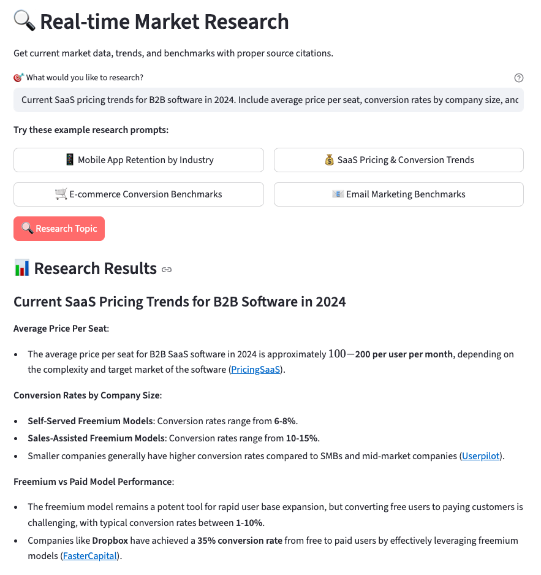

# 🤖 Diffbot Conversational Analytics Dashboard

Transform your data analysis workflow with AI that executes real code and provides transparent calculations. This Streamlit application demonstrates how to build conversational analytics using [Diffbot LLM](https://diffy.chat/) for A/B testing and market research.

**[Try the live app →](https://diffbot-analytics-efk2d4andktn3zv4ejs4zs.streamlit.app/)**

## ✨ Features

### 📈 A/B Test Analyzer
- Input control and treatment group data
- Get comprehensive statistical analysis with p-values, confidence intervals
- View interactive visualizations of conversion rates
- Get results with transparent JavaScript calculations


### 🔍 Real-time Market Research  
- Research any topic with current data and proper citations
- Quick access to common benchmarks (mobile app, e-commerce, SaaS)
- Get industry statistics with source attribution




## 🚀 Quick Start

### Prerequisites
- Python 3.11+
- pip (comes with Python)
- Diffbot API token ([Get free token](https://app.diffbot.com/get-started))

### Installation

1. **Clone or download this repository**
   ```bash
   git clone https://github.com/yourusername/diffbot-analytics.git
   cd diffbot-analytics
   ```

2. **Install dependencies**
   ```bash
   pip install -r requirements.txt
   ```

3. **Set up environment variables**
   ```bash
   cp .env.example .env
   # Edit .env and add your DIFFBOT_API_TOKEN
   ```

4. **Run the application**
   ```bash
   streamlit run analytics_dashboard.py
   ```

5. **Open your browser** to `http://localhost:8501`

## 🌐 Deployment with Streamlit Cloud

1. Fork this repository to your GitHub account
2. Visit [share.streamlit.io](https://share.streamlit.io)
3. Connect your GitHub account
4. Select your repository and `analytics_dashboard.py`
5. Add `DIFFBOT_API_TOKEN` to Streamlit Cloud secrets
6. Deploy with one click!

Your app will be available at: `https://your-username-diffbot-analytics-main.streamlit.app`

## 📊 Usage Examples

### A/B Test Analysis
1. Navigate to the "A/B Test Analyzer" tab
2. Enter your control group data (users and conversions)
3. Enter your treatment group data
4. Click "Analyze A/B Test"
5. Get statistical significance, p-values, and confidence intervals
6. Download results as CSV

### Market Research
1. Go to "Market Research" tab
2. Enter your research topic (e.g., "mobile app retention rates 2024")
3. Or use quick research buttons
4. Get current industry data with citations
5. Export findings


## 📁 Project Structure

```
diffbot-analytics/
├── analytics_dashboard.py      # Main Streamlit application with UI components
├── config.py                  # Configuration settings
├── diffbot_api.py             # Diffbot API integration
├── utils.py                   # Data processing and visualization utilities
├── requirements.txt           # Python dependencies
├── .env.example              # Environment variable template
├── .gitignore               # Git ignore rules
├── README.md               # This documentation
├── .streamlit/
│   └── config.toml         # Streamlit theme configuration
├── images/
│   ├── ab_test.png         # A/B test interface screenshot
│   └── market_research.png # Market research interface screenshot
├── sample_data/
│   ├── ab_test_sample.csv  # Sample A/B test data
│   └── sales_data_sample.csv # Sample sales data
└── deploy/
    └── streamlit_cloud.md  # Streamlit Cloud deployment guide
```


## 📄 License

This project is licensed under the MIT License. See [LICENSE](LICENSE) for details.

## 🔗 Related Resources

- [Diffy Chat Documentation](https://diffy.chat/)
- [Original Article: Transparent Calculations and Real-Time Research](https://codecut.ai/conversational-ai-code-execution-data-analysis/)
- [CodeCut AI Blog](https://codecut.ai/) - More data science tutorials

---

Built with ❤️ using [Streamlit](https://streamlit.io/) and [Diffbot LLM](https://diffy.chat/)